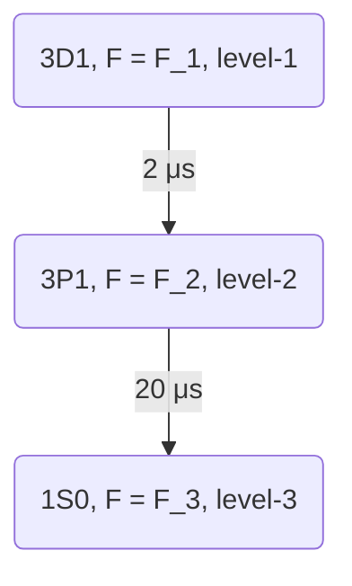

# DecayDynamics

## Single particle, multi level

- Notation following [2].

$$\begin{gathered}
\mathscr{H}= \sum_{q = -1}^1 \sum_{i = g, e} \mu_B g_i \mathbf{F}^i \cdot \mathbf{B} \\
\mathscr{L}[\rho]=\sum_{q = -1}^1 \frac{\Gamma_{q}}{2}\left(2 \hat{\Sigma}_{ q^{\prime}} \rho \hat{\Sigma}_{q}^{\dagger}-\hat{\Sigma}_{q}^{\dagger} \hat{\Sigma}_{q} \rho -\rho \hat{\Sigma}_{q}^{\dagger} \hat{\Sigma}_{q} \right) \\
J_{q}=0 \\
\Gamma_{q}=\frac{2 \mu_0 \omega_0^2}{\hbar}|\wp|^2 \hat{\mathbf{e}}_q \cdot \operatorname{Im} \mathbf{G}\left(\mathbf{0}, \mathbf{0}, \omega_0\right) \cdot \hat{\mathbf{e}}_{q}^* = 1\ [\text{Simulation unit}] \\
\mathbf{G}\left(\mathbf{r}, \omega_0\right)=\frac{e^{\mathrm{i} k_0 r}}{4 \pi k_0^2 r^3}\left[\left(k_0^2 r^2+\mathrm{i} k_0 r-1\right) \mathbb{1} + \left(-k_0^2 r^2-3 \mathrm{i} k_0 r+3\right) \frac{\mathbf{r} \otimes \mathbf{r}}{r^2}\right] \\
\hat{\Sigma}_{q}^{\dagger}=\sum_{m_g=-F_g}^{F_g} C_{m_g, q} \hat{\sigma}_{F_e m_g-q, F_g m_g} \\
\hat{\sigma}_{F_e m_g-q, F_g m_g}=\left|F_e m_g-q \right> \left< F_g m_g\right| \\
C_{m_g, q}=(-1)^{F_g-m_g}\left(\begin{array}{llc}
F_g & 1 & F_e \\
-m_g & q & m_g-q
\end{array}\right)
\end{gathered}$$

$C_{m_g, q}$ is the Clebsch–Gordan coefficient, $\hat{\mathbf{e}}_q$ is the polarization vector in Cartesian coordinate. 

To calculate the radiation power at $\mathbf{r}$, evaluate 

$$\begin{gathered}
I(\mathbf{r}) = \left\langle \psi \right| \hat{\mathbf{E}}^{-} (\mathbf{r}) \cdot \hat{\mathbf{E}}^{+} (\mathbf{r}) \left| \psi \right\rangle
\end{gathered}$$

, where the electric field operator is defined as

$$\begin{gathered}
\hat{\mathbf{E}}^{+}(\mathbf{r})= \mu_{0} \omega_{0}^2 \sum_{q = -1}^1 \mathbf{G} \left(\mathbf{r}, 0, \omega_{0} \right) \cdot \hat{\mathbf{e}}_{q}^{*} \wp \hat{\Sigma}_{j q}.
\end{gathered}$$


## Cascaded multilevel
### Schematics



First we define atomic lowering operator again.

$$
\begin{gathered}
{\hat{\Sigma}_{q}^{F_1, F_2}}^{\dagger}=\sum_{m_2=-F_2}^{F_2} C_{m_2, q}^{F_1, F_2} \hat{\sigma}_{F_1, m_2-q, F_2, m_2} \\
C_{m_2, q}^{F_1, F_2} = (-1)^{F_2-m_2}\left(\begin{array}{llc}
F_2 & 1 & F_1 \\
-m_2 & q & m_2-q
\end{array}\right)
\end{gathered}
$$

Green function is depending on the wavelength of the transition.

$$ 
\mathbf{G}\left(\mathbf{r}, \omega_i\right)=\frac{e^{\mathrm{i} k_i r}}{4 \pi k_i^2 r^3}\left[\left(k_i^2 r^2+\mathrm{i} k_i r-1\right) \mathbb{1} + \left(-k_i^2 r^2-3 \mathrm{i} k_i r+3\right) \frac{\mathbf{r} \otimes \mathbf{r}}{r^2}\right]
$$

However, this will not matter as long as we are considering a single atom. It will not change the angular dependence of the radiation pattern as well. 

We set the decay rate of level-$i$ $\Gamma_q^i$ to be 10(1) for the level-1(2).

$$
\mathscr{L}[\rho]=\sum_{i = 1}^2 \sum_{q = -1}^1 \frac{\Gamma_{q}^{i}}{2}\left(2 \hat{\Sigma}_{ q^{\prime}}^{F_i, F_{i+1}} \rho {\hat{{\Sigma}_{q}}^{F_i, F_{i+1}}}^{\dagger}-{\hat{\Sigma}_{q}^{F_i, F_{i+1}}}^{\dagger} \hat{\Sigma}_{q}^{F_i, F_{i+1}} \rho -\rho {\hat{\Sigma}_{q}^{F_i, F_{i+1}}}^{\dagger} \hat{\Sigma}_{q}^{F_i, F_{i+1}} \right)
$$

For the Hamiltonian, we have rotating terms.
$$
\mathscr{H}=\hbar \sum_{i = 1}^3 \mu_B g_i \mathbf{F}^i \cdot \mathbf{B}
$$

## Many particle, multi level

TBA?
<!-- 
- Notation following [2].

$$\begin{gathered}
\mathscr{H}=\hbar \sum_{i, j=1}^N \sum_{q, q^{\prime}=-1}^1 J_{i j q q^{\prime}} \hat{\Sigma}_{i q}^{\dagger} \hat{\Sigma}_{j q^{\prime}}, \\
\mathscr{L}[\rho]=\sum_{i, j=1}^N \sum_{q, q^{\prime}=-1}^1 \frac{\Gamma_{i j q q^{\prime}}}{2}\left(2 \hat{\Sigma}_{j q^{\prime}} \rho \hat{\Sigma}_{i q}^{\dagger}-\hat{\Sigma}_{i q}^{\dagger} \hat{\Sigma}_{j q^{\prime}} \rho\right. \\
\left.-\rho \hat{\Sigma}_{i q}^{\dagger} \hat{\Sigma}_{j q^{\prime}}\right)
\end{gathered}$$
$$
\begin{aligned}
& J_{i j q q^{\prime}}=-\frac{\mu_0 \omega_0^2}{\hbar}|\wp|^2 \hat{\mathbf{e}}_q \cdot \operatorname{Re} \mathbf{G}\left(\mathbf{r}_i, \mathbf{r}_j, \omega_0\right) \cdot \hat{\mathbf{e}}_{q^{\prime}}^*, \\
& \Gamma_{i j q q^{\prime}}=\frac{2 \mu_0 \omega_0^2}{\hbar}|\wp|^2 \hat{\mathbf{e}}_q \cdot \operatorname{Im} \mathbf{G}\left(\mathbf{r}_i, \mathbf{r}_j, \omega_0\right) \cdot \hat{\mathbf{e}}_{q^{\prime}}^*,
\end{aligned}
$$
$$
\begin{aligned}
& \mathbf{G}\left(\mathbf{r}, \omega_0\right)=\frac{e^{\mathrm{i} k_0 r}}{4 \pi k_0^2 r^3}\left[\left(k_0^2 r^2+\mathrm{i} k_0 r-1\right) \mathbb{1}+\left(-k_0^2 r^2-3 \mathrm{i} k_0 r+3\right) \frac{\mathbf{r} \otimes \mathbf{r}}{r^2}\right], \\
&
\end{aligned}
$$

To calculate the electric field, 
$$
\hat{\mathbf{E}}^{+}(\mathbf{r})=\mu_0 \omega_0^2 \sum_{j=1}^N \sum_{q=-1}^1 \mathbf{G}\left(\mathbf{r}, \mathbf{r}_j, \omega_0\right) \cdot \hat{\mathbf{e}}_q^* \wp \hat{\Sigma}_{j q}
$$ -->
## Questions
- [ ] Do we expect the quantum beats if we project the polarization of the light so that we make different polarization of the light indistinguishible?


## Reference
1.  D. A. Steck, Quantum and Atom Optics (2022).
2.  A. Asenjo-Garcia, H. J. Kimble, D. E. Chang, Proc. Natl. Acad. Sci. U.S.A. 116, 25503–25511 (2019).
3.  B. Zhu, J. Cooper, J. Ye, A. M. Rey, Phys. Rev. A. 94, 023612 (2016).
4.  [`CollectiveSpins.jl`](https://qojulia.github.io/CollectiveSpins.jl/dev/descriptions/) theoretical description page.

# Activating this project

To (locally) reproduce this project, do the following:

0. Download this code base. Notice that raw data are typically not included in the
   git-history and may need to be downloaded independently.
1. Open a Julia console and do:
   ```
   julia> using Pkg
   julia> Pkg.add("DrWatson") # install globally, for using `quickactivate`
   julia> Pkg.activate("path/to/this/project")
   julia> Pkg.instantiate()
   ```
   
This will install all necessary packages for you to be able to run the scripts and
everything should work out of the box, including correctly finding local paths.

You may notice that most scripts start with the commands:
```julia
using DrWatson
@quickactivate "DecayDynamics"
```
which auto-activate the project and enable local path handling from DrWatson.
<!-- This code base is using the [Julia Language](https://julialang.org/) and
[DrWatson](https://juliadynamics.github.io/DrWatson.jl/stable/)
to make a reproducible scientific project named
> DecayDynamics

It is authored by Kyungtae Kim.
<!-- 
To (locally) reproduce this project, do the following:

0. Download this code base. Notice that raw data are typically not included in the
   git-history and may need to be downloaded independently.
1. Open a Julia console and do:
   ```
   julia> using Pkg
   julia> Pkg.add("DrWatson") # install globally, for using `quickactivate`
   julia> Pkg.activate("path/to/this/project")
   julia> Pkg.instantiate()
   ```

This will install all necessary packages for you to be able to run the scripts and
everything should work out of the box, including correctly finding local paths.

You may notice that most scripts start with the commands:
```julia
using DrWatson
@quickactivate "DecayDynamics"
```
which auto-activate the project and enable local path handling from DrWatson. -->
